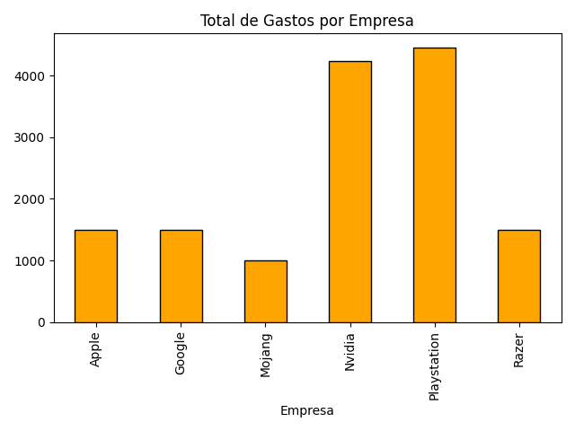
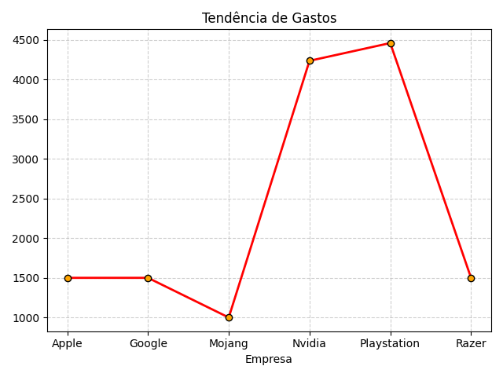
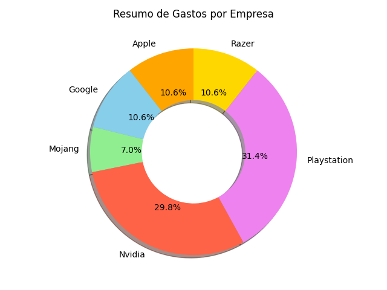

# Gerenciador de Gastos com Análise de Dados 📊

Sistema em Python para controle financeiro empresarial com armazenamento em JSON e geração automática de relatórios estatísticos e gráficos.

## ✨ Funcionalidades
* **Gestão de Emrpesas:** Cadastro e remoção de empresas.
* **Controle de Fluxo:** Registro de gastos com tratamento de valores (R$ ou internacional).
* **Persistência de dados:** Armazenamento seguro em arquivo JSON.
* **Análise de Dados com Pandas:** Soma total e média por empresa.
* **Menu de Relatórios:** Geração sob demanda de gráficos de Barras, Linhas e Rosca (Donut Chart).
* **Exportação:** Salvamento automático dos relatórios em formato `.png`.

## 📊 Relatórios Gerados
| Comparação (Barras) | Tendência (Linhas) | Distribuição (Rosca) |
| :---: | :---: | :---: |
|  |  |  |

## 🛠️ Tecnologias 
* Python 3.12
* Pandas(Processamento de dados)
* Matplotlib (Visualização)
* JSON (Armazenamento)

## 🚀 Como rodar
1. Clone o repositório
2. Crie um ambiente virtual: `python3 -m venv venv`(Linux).
3. Ative o venv: `source venv/bin/activate` (Linux).
4. Instale as dependências: `pip install -r requirements.txt`
5. Execute: `python gerenciador_de_gastos.py`.

